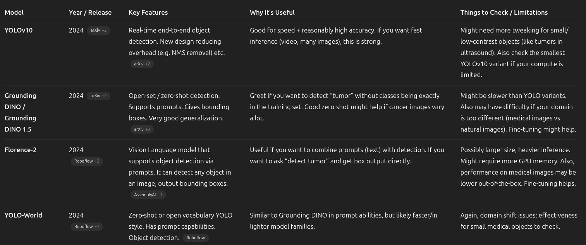

### 1. **Florence-2 (Microsoft, 2024)** - BEST OPEN SOURCE OPTION
- Text prompting capabilities
- Same transfer learning benefits as RetinaNet
- Direct fine-tuning repositories available on GitHub
- Tutorial for fine-tuning Florence-2 on object detection datasets
- Roboflow notebook with step-by-step implementation
- Florence-2 is lightweight (0.2B and 0.7B parameters) with strong performance, released under MIT license

### 2. **Grounding DINO (2024 Enhanced)**
- Official ECCV 2024 implementation available
- **Repository**: https://github.com/IDEA-Research/GroundingDINO
- Well-established with good documentation

### 3. **YOLOv10 (NeurIPS 2024)**
- Official implementation with efficiency-accuracy optimization
- **Repository**: https://github.com/THU-MIG/yolov10
- Real-time performance optimized

### 4. **InternVideo2**
- Available at OpenGVLab/InternVideo repository
- Video-focused foundation model



**Transfer Learning Approach (Same as RetinaNet):**
```
Florence-2 (COCO pre-trained) → Fine-tune on gallbladder annotations → Test on medical videos
```